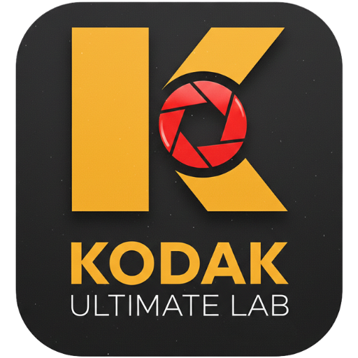

  

<h1 align="center">🎞️ K-LAB ULTIMATE v5.0</h1>

  <strong>Universal Digital Photo Station</strong> 
  <em>L'élégance de l'argentique au service de la précision numérique.</em>

  
  
  

---

## 📸 Le Concept
**K-LAB ULTIMATE** est un laboratoire de développement virtuel conçu pour les photographes qui veulent retrouver le grain et la colorimétrie des pellicules mythiques (Kodak, Fuji, Cinestill) sans la lourdeur des logiciels pro traditionnels.

> "Une interface sombre pour une concentration totale sur l'image."

---

## 🛠️ Fonctionnalités "Power-User"

### 🎞️ Labo de Pellicules (35+ Presets)
Accédez instantanément aux rendus iconiques :
* **Série Kodak :** Portra 400, Gold 200, Ektar, Tri-X (B&W).
* **Série Fujifilm :** Pro 400H, Velvia, Superia, Natura 1600.
* **Cinéma & Exotique :** Cinestill 800T, Technicolor, Lomo Purple.

### 🧠 Intelligence Artificielle (Auto-Lab)
Chaque photo importée est analysée par notre algorithme pour calibrer l'exposition et la chaleur optimale en fonction de la luminance réelle du capteur.

### ⌨️ Workflow Ultra-Rapide
| Touche | Action |
| :--- | :--- |
| <kbd>←</kbd> <kbd>→</kbd> | Navigation éclair dans la bibliothèque |
| <kbd>ESPACE</kbd> | **Preview Critique** (Plein écran sans distraction) |
| <kbd>ENTRÉE</kbd> | **Export Instantané** (JPEG High-Quality) |
| <kbd>SUPPR</kbd> | Retrait rapide de la sélection |

---

## 🎨 Design & Ergonomie
L'application respecte les codes esthétiques des stations de travail haut de gamme :
* **Dark Mode Natif :** Fond `#050505` pour respecter la chromie des photos.
* **Responsive :** Travaillez aussi bien sur votre Mac que sur iPad ou iPhone.
* **Privacy First :** Aucun serveur. Vos photos restent sur votre machine.

---

## 🚀 Installation Rapide (PWA)

1.  **Hébergement :** Déployez sur GitHub Pages.
2.  **Sur Chrome (Desktop) :** Cliquez sur l'icône "Installer" dans la barre d'URL.
3.  **Sur Mobile :** "Ajouter sur l'écran d'accueil" pour une expérience sans bordure.

---

   
  <b>Développé par <a href="https://github.com/antoto">Antonin THOREL (@antoto)</a></b> 
  <em>Propulsé par Vanilla JS & Passion Argentique</em> 
  <small>© 2026 K-LAB Stations. Tous droits réservés.</small>

